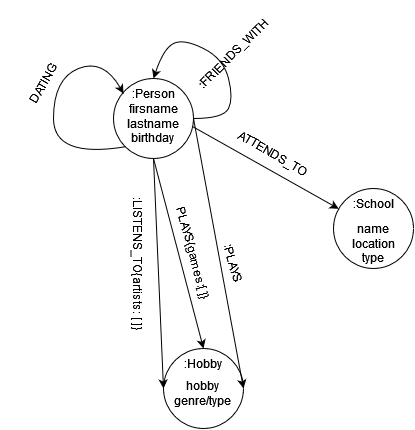

# M165_NOSQL
## Nachricht an Herr Nussle :)
Grüezi Herr Nussle

Wir haben uns sehr viel Mühe für dieses Projekt gegeben und denken, dass unser Projekt wirklich sehr gut rausgekommen ist. Da unsere Noten ganz knapp an eine 4.5 und 6 sind, möchten wir Ihnen fragen, ob Sie diese falls möglich aufrunden könnten.
Vielen Dank und wir wünschen Ihnen eine schöne Woche.
-Kalel und Zakria :D
## GraphDB Überblick

## Dokumentation

Wir haben uns entschieden, mit der Graph-Database Neo4J eine Mini soziale Netzwerk zu erstellen. 
Die Nodes sind Personen, die wir kennen. Das Ziel wäre herauszufinden, ob sich zwischen den Individuen Beziehungen vorhanden sind, die mit blossen Augen nicht ersichtlich sind.
## Logisches Diagramm

